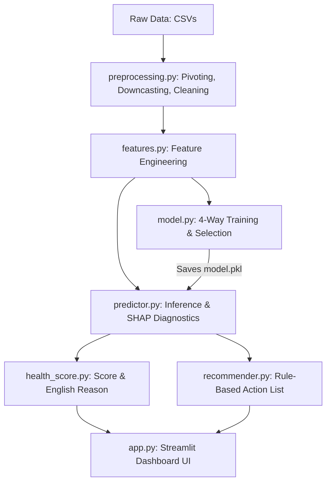

# Telecom Fault Prediction: Project Analysis & Summary

This document provides a comprehensive summary of the Telecom Fault Prediction project, analyzing the codebase, machine learning pipeline, and Streamlit NOC dashboard.

---

## 1. Overview
* **What does this project do?**  
  This project classifies telecommunication network disruptions into three fault severity levels (0: No Fault, 1: Minor Fault, 2: Major Fault) based on service logs, event triggers, and infrastructure resource logs. It visualizes active device statuses on a Network Operations Center (NOC) dashboard to help teams quickly identify anomalies.
* **What problem does it solve?**  
  Telecommunication networks generate millions of sparse logs and events during a disruption. Manually investigating these logs to pinpoint severity and root causes is slow, causing high Mean Time to Resolution (MTTR). This system automates classification, runs explainable AI (XAI) diagnostics, and provides rule-based recommendations, helping NOC engineers prioritize and troubleshoot critical issues.

---

## 2. Tech Stack
* **Python**: Core programming language used to build the pipeline, model, and web dashboard.
* **Pandas**: Used in [`preprocessing.py`](file:///d:/Proj/Telecom/TelecomFaultPrediction/src/preprocessing.py) and [`features.py`](file:///d:/Proj/Telecom/TelecomFaultPrediction/src/features.py) for loading CSVs, pivoting sparse datasets (e.g. events, logs, resources) on `id` into a unified wide row format, memory downcasting, and frequency-encoding location data.
* **NumPy**: Used in [`health_score.py`](file:///d:/Proj/Telecom/TelecomFaultPrediction/src/health_score.py) for array boundary clipping (`np.clip`).
* **Scikit-Learn**:
  - `train_test_split` with stratification (`stratify=y`) in [`model.py`](file:///d:/Proj/Telecom/TelecomFaultPrediction/src/model.py) for balanced splitting.
  - `compute_sample_weight` in [`model.py`](file:///d:/Proj/Telecom/TelecomFaultPrediction/src/model.py) to calculate sample weights for mitigating class imbalance.
  - `RandomForestClassifier`, `GradientBoostingClassifier`, and `LinearSVC` as comparison baseline models.
  - `accuracy_score`, `precision_score`, `recall_score`, `f1_score`, `log_loss`, and `confusion_matrix` for model evaluation.
* **XGBoost (`XGBClassifier`)**: Selected as the final champion classifier in [`model.py`](file:///d:/Proj/Telecom/TelecomFaultPrediction/src/model.py) due to high performance and recall on Class 2 faults.
* **SHAP (`shap.TreeExplainer`)**: Used in [`predictor.py`](file:///d:/Proj/Telecom/TelecomFaultPrediction/src/predictor.py) to extract Shapley contribution values for single-record predictions, exposing which features drove the classification.
* **Joblib**: Used for saving and loading the trained model binary (`model.pkl`) and location frequency mapping (`location_freq_map.pkl`) under the `models/` directory.
* **Streamlit**: Used in [`app.py`](file:///d:/Proj/Telecom/TelecomFaultPrediction/app.py) to construct the interactive NOC Command Center dashboard.
* **Plotly**: Used in [`app.py`](file:///d:/Proj/Telecom/TelecomFaultPrediction/app.py) for rendering high-contrast horizontal bar charts ranking location risk.
* **GC (Garbage Collector)**: Triggered manually inside [`preprocessing.py`](file:///d:/Proj/Telecom/TelecomFaultPrediction/src/preprocessing.py) using `gc.collect()` to free memory during large data pivoting/merging.

---

## 3. Architecture
The codebase separates concerns across a clean layer model:

### Folder Structure
* **`data/raw/`**: Raw CSV data files representing train/test tables and logs (`train.csv`, `event_type.csv`, `log_feature.csv`, `resource_type.csv`, `severity_type.csv`).
* **`models/`**: Serialized artifacts (`model.pkl`, `location_freq_map.pkl`).
* **`src/`**: Core logic and pipeline scripts.
  - [`preprocessing.py`](file:///d:/Proj/Telecom/TelecomFaultPrediction/src/preprocessing.py): Functions `load_and_merge()` and `clean_data()`.
  - [`features.py`](file:///d:/Proj/Telecom/TelecomFaultPrediction/src/features.py): Function `build_features()`.
  - [`model.py`](file:///d:/Proj/Telecom/TelecomFaultPrediction/src/model.py): Function `train_and_compare()`.
  - [`predictor.py`](file:///d:/Proj/Telecom/TelecomFaultPrediction/src/predictor.py): Functions `predict()` and `explain()`.
  - [`health_score.py`](file:///d:/Proj/Telecom/TelecomFaultPrediction/src/health_score.py): Functions `compute_health_score()` and `format_explanation()`.
  - [`recommender.py`](file:///d:/Proj/Telecom/TelecomFaultPrediction/src/recommender.py): Function `recommend_action()`.
* **[`app.py`](file:///d:/Proj/Telecom/TelecomFaultPrediction/app.py)**: Streamlit dashboard displaying overall metrics, location bar charts, and a device infrastructure monitoring list.
* **[`test_diagnose.py`](file:///d:/Proj/Telecom/TelecomFaultPrediction/test_diagnose.py)**: Quick entry point to run prediction and explanation logic on a test record.

---

## 4. Key Concepts
* **Supervised Multi-Class Classification**: Categorizing disruption records into three ordinal categories: 0, 1, or 2.
* **Class Imbalance Mitigation**: Managed via class-stratified splits and sample weights using Scikit-Learn's `compute_sample_weight('balanced', y_train)` during the gradient descent optimization step of XGBoost and Gradient Boosting.
* **Wide Feature Pivoting & Alignment**: Transforming one-to-many relationship log entries into flat wide columns based on a unique incident ID. Includes dynamically aligning incoming single-record feature dictionaries to match the exact list of feature names expected by the model.
* **Explainable AI (XAI)**: Computing SHAP values via a Tree Explainer to identify which active event triggers or log volumes contributed to the predicted severity class.
* **Rule-Based Translation**: Applying conditional logic to SHAP factors to map mathematical values to human-readable maintenance recommendations.
* **Memory Optimization**: Minimizing Python memory footprint by deleting intermediate DataFrames (`del`) and invoking `gc.collect()` manually.

---

## 5. Features
* **4-Way Classification Comparison**: Evaluates Random Forest, Gradient Boosting, XGBoost, and LinearSVC on Accuracy, Macro Precision/Recall/F1, and Log-Loss, printing a comparison table and confusion matrices.
* **Automated Model Saving**: Automatically persists the fitted location frequency encoder dictionary and the best model binary to disk.
* **NOC Dashboard Overview**: Includes real-time indicators for Global Health % (average score of active devices), Total Critical Devices, Total Warning Devices, and Total Healthy Devices.
* **Location-Based Risk Ranking**: An interactive Plotly chart listing the worst 15 locations sorted by average health score.
* **Real-Time Device Monitor**: Displays card objects for individual devices (sorted worst-first), with status filters (All, Critical, Warning, Healthy).
* **Single-Record Diagnostic Engine**: Evaluates raw inputs, computes a 0-100 health score, runs SHAP explanations, formats reasons into plain English, and maps them to a set of recommended actions.

---

## 6. Notable Implementation Details
* **Memory Management during Pivots**: The `load_and_merge()` function in [`preprocessing.py`](file:///d:/Proj/Telecom/TelecomFaultPrediction/src/preprocessing.py) pivots auxiliary datasets with thousands of sparse columns. It prevents memory overflow by casting values to `int32`, deleting raw tables, and running garbage collection after each merge step.
* **Dynamic Inference Alignment**: Raw single-record dict inputs might be missing logs or resource types that were present during training. The `_preprocess_record()` function in [`predictor.py`](file:///d:/Proj/Telecom/TelecomFaultPrediction/src/predictor.py) resolves this by referencing the trained model's `feature_names_in_` property and dynamically appending missing columns initialized to zero.
* **TreeExplainer Dimension Resolution**: SHAP output shapes differ depending on the classifier library used. The `explain()` function in [`predictor.py`](file:///d:/Proj/Telecom/TelecomFaultPrediction/src/predictor.py) contains conditional blocks to parse SHAP dimensions correctly whether they return as a 3D NumPy array, a list of 2D arrays, or a 2D array.
* **Health Score Penalty Math**: In [`health_score.py`](file:///d:/Proj/Telecom/TelecomFaultPrediction/src/health_score.py), the formula `100 - (P(Class 1)*40 + P(Class 2)*100)` penalizes high probability of major faults (Class 2) by a factor of 100 (sending score to 0), and minor faults (Class 1) by a factor of 40, capping the final score to a `[0, 100]` range.
* **LinearSVC Probability Handling**: `LinearSVC` does not support probability calibration natively. The training script handles this gracefully by reporting its Log-Loss metric as `"N/A (uncalibrated)"` without throwing a runtime error.

---

## 7. Interview Walkthrough Pitch

> [!TIP]
> **When asked, "Walk me through this project," you can confidently say:**
>
> *"I developed a Telecom Fault Prediction pipeline and NOC Command Center dashboard using Kaggle's Telstra Network Disruptions dataset. Since the data consisted of sparse, one-to-many relationship log tables, I engineered a preprocessing pipeline in Pandas that pivoted and merged these tables into a wide feature dataset, using memory optimization techniques like downcasting and garbage collection to prevent memory leaks. I trained and compared four models, selecting XGBoost as the champion model. To make the model explainable, I integrated SHAP (TreeExplainer) to diagnose the specific log anomalies driving each prediction, and built a rule-based engine that maps these SHAP factors into plain-English recommendations. Finally, I wrapped the pipeline in a high-performance Streamlit dashboard showing real-time global health metrics, location-based risk rankings, and status-filterable device health lists."*
